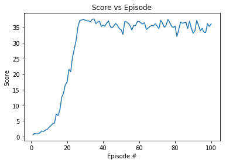

# Continuous control with Deep Deterministic Policy Gradients(DDPG)

## Introduction

In this environment, 20 double-jointed arm can move to target locations. A reward of +0.1 is provided for each step that the agent's hand is in the goal location. Thus, the goal of the agents is to maintain its position at the target location for as many time steps as possible.

The observation space consists of 33 variables corresponding to position, rotation, velocity, and angular velocities of the arm. Each action is a vector with four numbers, corresponding to torque applicable to two joints. Every entry in the action vector should be a number between -1 and 1.
For test log see [Continuous control DRL test log.pdf](https://github.com/zhuohann/ContinousControl/blob/master/Continuous%20control%20DRL%20test%20log.pdf)

## Getting Started 
**Step 1:**

`git clone https://github.com/zhuohann/ContinousControl`

**Step 2:**

Use the package manager [pip](https://pip.pypa.io/en/stable/).
```bash
pip install -r requirements.txt
```

**Step 3:**

Download the Unity environment:
- [Linux](https://s3-us-west-1.amazonaws.com/udacity-drlnd/P2/Reacher/Reacher_Linux.zip)  
- [Mac OSX](https://s3-us-west-1.amazonaws.com/udacity-drlnd/P2/Reacher/Reacher.app.zip)
- [Windows (32-bit)](https://s3-us-west-1.amazonaws.com/udacity-drlnd/P2/Reacher/Reacher_Windows_x86.zip)
- [Windows (64-bit)](https://s3-us-west-1.amazonaws.com/udacity-drlnd/P2/Reacher/Reacher_Windows_x86_64.zip)

## Result

The agents were able to reach an average score of 30 after 30 episodes:

## Usage

Run Jupyter notebook

## Contributing
Pull requests are welcome. For major changes, please open an issue first to discuss what you would like to change.


## License
[MIT](https://choosealicense.com/licenses/mit/)
